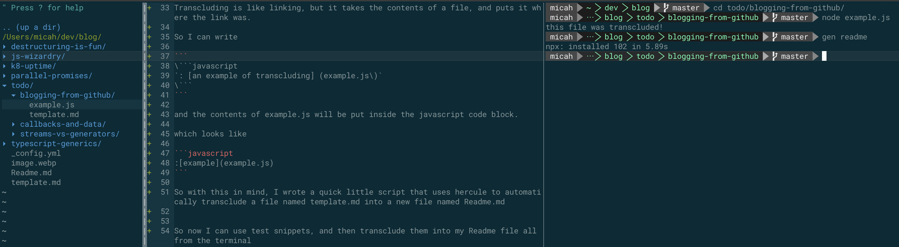
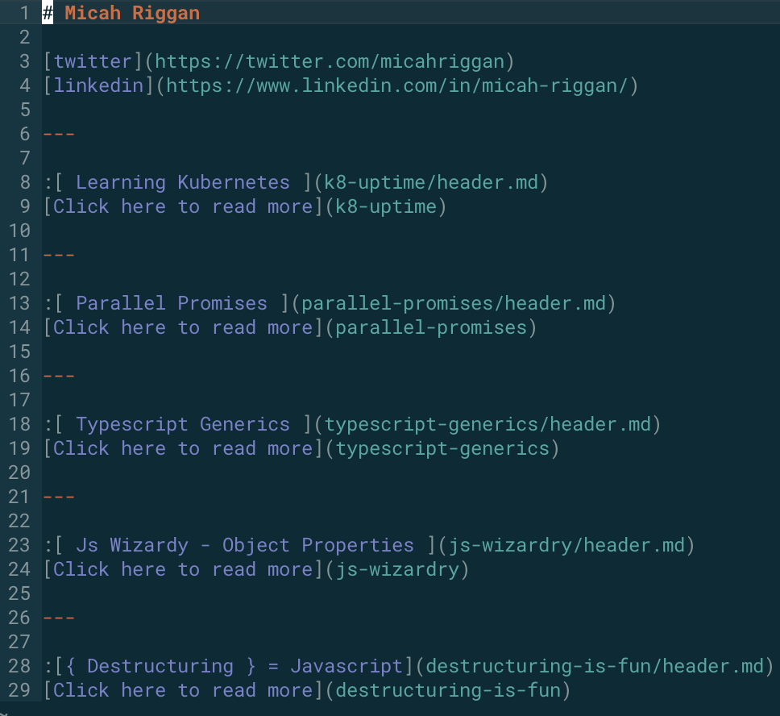

:[header](header.md)

## Dev style
I've a big fan of vim+tmux. I like being able to quickly open terminals, jumping from editor panes to terminal panes and running snippets of code to test them.

I've been a vim person for 3 years now, so that feels like home. I like the splitting, jumping from tab to tab, file to file, buffer to buffer. It feels simple and snappy.

That's how I want blogging to feel, simple, and snappy. This approach is new, and will probably evolve a good bit, but I like it so far.


## Blog Goals
* Simplicity - I should be able to write a post quickly and have it online without doing very much
* Code friendly - I should be able to write technical posts, and run the snippets in my post, so I can be sure they work


## Simplicity
My posts are all written as Readme files as markdown, and pushed to my blog repo on [github](https://github.com/micahriggan/blog).

When I have post ideas, I create a folder in my todo folder.

If I want that folder to be committed, I'll create a `template.md` file. More on that later

Deploying is as simple as a git push since I'm using github static pages.


## Code Friendly
I want to blog about code, and I don't want to have to copy and paste updates into my posts as I refine the code.

After searching for a bit, I found out you can transclude markdown files with a tool called hercule

Transcluding is like linking, but it takes the contents of a file, and puts it where the link was.

So I can write

    ```javascript
    : [an example of transcluding] (example.js)
    ````

and the contents of example.js will be put inside the javascript code block.

which looks like 

```javascript
:[example](example.js)
```

If this is unclear, feel free to checkout the [template.md for this post](template.md)

## Make tools for yourself

So with this in mind, I wrote a quick little script that uses hercule to automatically transclude a file named template.md into a new file named Readme.md

To run this I just type `gen readme`


So now I can use test snippets, and then transclude them into my Readme file all from the terminal

This testing phase tends to look like the following.




## Wrapping it all up
Using hercule is awesome, because now I can break my post into multiple files, and then recombine them.

One interesting usecase I've found for this, is breaking the header into it's own file, and then using it again in my toplevel readme.

Once I've finished my post, I move the folder up a directory, and add a reference to it in the top level [template.md](../template.md) file

## Posting to dev.to
After pushing everything up to github, I copy the markdown, and find all relative links, and replace them with absolute links to the github repo. 

Now all my pictures and links should work.




This makes it pretty easy to maintain an index of my posts, with little summaries, which update when I change the corresponding file

## Conclusion
You can use hercule to turn your files into components, which can be imported into multiple markdown files. This allows you to write tests against examples, and have your blog posts update as you change source files.


