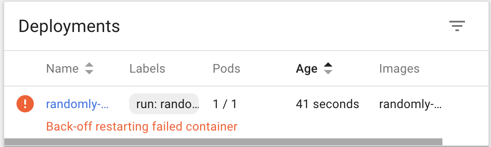
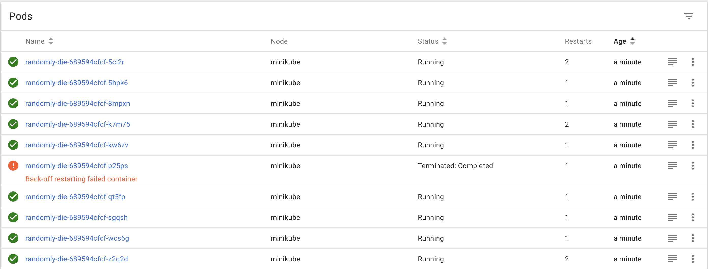

# Kubernetes First Time Project - Auto-Restarting
Today I gave kubernetes a shot for the first time. I was interested in it's auto-restart feature, so I wrote a simple node.js program

```javascript
// application that randomly dies, and see how good kubernetes is at restarting it.
console.time('alive');
setTimeout(() => {
  console.timeEnd('alive');
  process.exit(0);
}, Math.random() * 60000);
setInterval(() => {
 console.log('feels good to be alive') 
}, 100)
```

I downloaded minikube, and virtual box, and ran 

```bash
minikube start
minikube dashboard
```

Then I made a super basic Dockerfile

```docker
FROM node
ADD randomly-die.js .
CMD ["node", "randomly-die.js"]
```

Now we've got to build this Docker image, and then create a deployment with kubernetes

```bash
eval $(minikube docker-env)
docker build -t randomly-die:1.0 .
kubectl run randomly-die --image randomly-die:1.0 --image-pull-policy=Never
```

Now we can check the deployments section of the dashboard and see that we have a deployment named randomly-die



From here we can see we have a replica set, and a single pod, which is running our container

Now if we check the pod logs we can see we're up and running

```
...
feels good to be alive
feels good to be alive
feels good to be alive
feels good to be alive
feels good to be alive
feels good to be alive
feels good to be alive
feels good to be alive
feels good to be alive
feels good to be alive
alive: 4856.096ms
```

# Scaling
Kubernetes makes it pretty easy to scale up how many containers are running. For my final test I wanted to see it run 10 randomly-die containers, and watch it restart them

```bash
kubectl scale deployment --replicas=10 randomly-die
# deployment.extensions "randomly-die" scaled
```
# Conclusion
Now we've got 10 containers running that randomly die, and we can watch the "restarts" counter increment as kubernetes restarts them.


Pretty cool!

